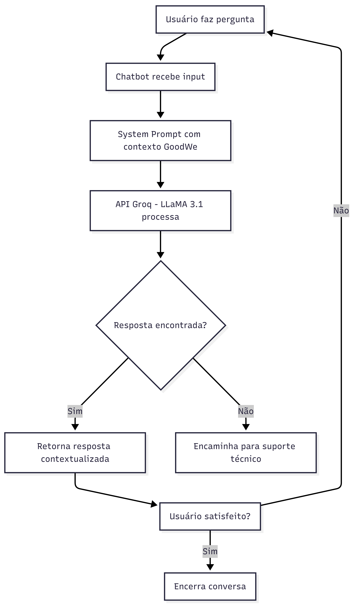

# Chatbot GoodWe — EV Challenge 2026

## Descrição
Chatbot com IA desenvolvido para auxiliar operadores, síndicos, moradores e técnicos
com dúvidas sobre os sistemas ChargeGrid Intelligence e EV ChargeOps da GoodWe.

## Tecnologias Utilizadas
- Python 3.14
- Groq API (LLaMA 3.1 8B Instant)
- python-dotenv

## Por que Groq + LLaMA 3.1?
- Gratuito e sem limitações de rede
- Rápido e eficiente para respostas em português
- Fácil integração via API REST
- Ideal para prototipagem rápida

## Estrutura do Projeto
chatbot-goodwe/
├── chatbot.py
├── .env
├── README.md
├── context/
│   └── goodwe_context.txt
└── docs/
    ├── fluxograma.png
    └── perguntas_teste.md

## Como Rodar
1. Clone o repositório
2. Crie o arquivo `.env` com sua chave: `GROQ_API_KEY=sua_chave`
3. Instale as dependências: `pip install requests python-dotenv`
4. Execute: `python chatbot.py`

## Personas Atendidas
- Operador comercial
- Síndico
- Morador
- Técnico

## Fluxograma
